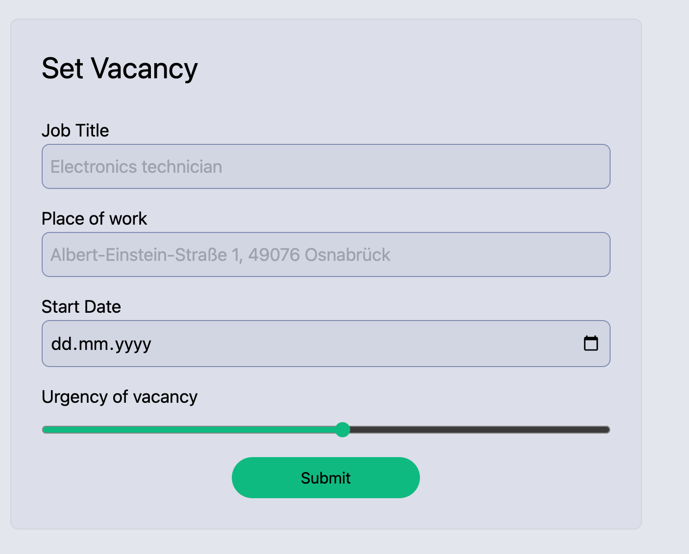
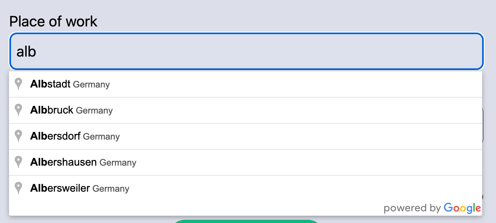

# 4EIGN Takehome

This repo serves as a base for your code. I included necessary/useful dependencies and you can install them using `pnpm install`. If you want to use additional dependencies, feel free to add them.

# Summary
Create an HTML form that consists of the following fields that the user is required to specify:
- Job Title (free text)
- Place of Work (free text with Google Maps suggestions)
- Start Date
- Urgency (slider)

It should look similar to this:

After submission and validation of the form, the entered information should still be visible in the form (like e.g. in a settings-page). This means that the data needs to be persisted on the server or in a DB.

# Requirements

## Validation

- "Job Title" can be any string
- "Place of Work" can be any string
- "Start Date" must be a date that is at least 3 months into the future
- "Urgency" must be an integer between 1 and 100

## Database

There is no need to use an actual database for this simple use case. Just think of some way to persist the data serverside. Of course, you can setup an actual database as well if you really want to.

## Deployment

Not needed. As long as I can run everything locally it's fine :)

## "Clean" Code

Write "as close to production" level code as possible. The user should have the best experience possible. Errors should be handled gracefully. The code should be easily maintainable and extendable.

## Bonus: Make the UI look great

If you manage to do it, make the UI look very nice with consistent branding (does not need to be 4EIGN branding). This is totally optional but something that would make you stand out.

# Tooling
- Use Tailwind and Skeleton for styling
- Use zod for validation
- Write fully typesafe code and make sure that `pnpm svelte-check` passes
- Use SvelteKit (obviously) but also try to write everything you can in a way that is native to SvelteKit
- The Google Maps API should be used to make it easy for the user to enter an address. You can use [this API key](google-maps-key.txt) (but please don't send too many request as the quota is configured very strict)

# Submission

Please invite me [louiskhub](https://github.com/louiskhub) to your **private** repo after you finished the task. Do not make the source code public!

Please include a short README in which you:
- outline everything that might not be immediately obvious from your code (although you should strive for code that is fairly self-explanatory).
- mention possible improvements in the future and considerations you would make when merging this into an existing codebase
- discuss approaches how we can secure our Google Maps API key against spammers and avoid getting a huge bill

# Questions?

For most things, just can just make assumptions. If there is anything really urgent, just [email me](mailto:l.kapp@4eign.de) :)